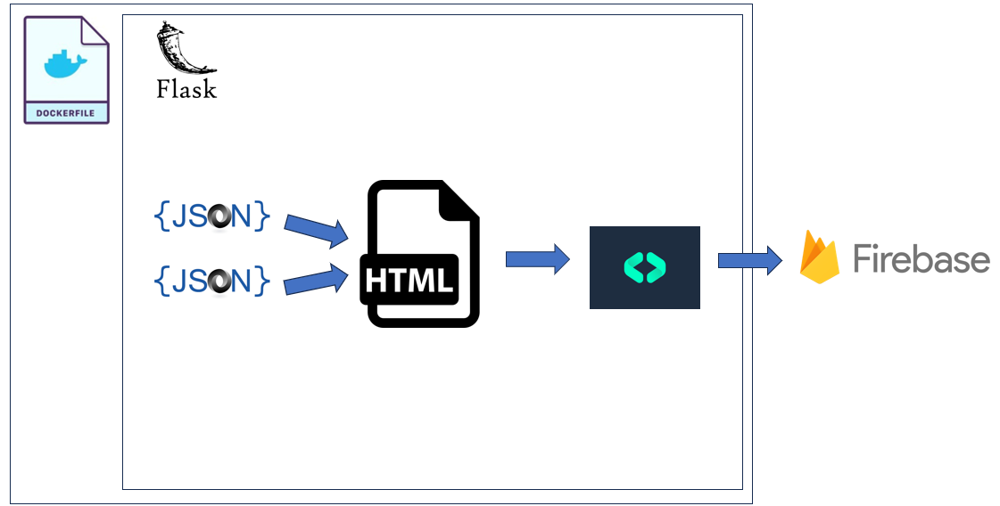

# JordanGpt

- **Introduction:**

I am not a company executive; therefore, I have no secretary, but, with the power of AI, I made the next best thing: JordanGpt. JordanGpt serves as my personal secretary, answering questions about my experience and career. JordanGpt exposes generic routes exposing information about my resume and work experience, in addition to a fine tuned chat bot, trained to be my secretary. This Flask API serves a similar function to a personal website, but with a backend and data flare, displaying knowledge of model deployment, prompt engineering, databases, RESTful APIs, system design, and data collection. This the front end is a rudimentary static web page. Finally, I hope to share a little bit of my youthful creativity, playfully and tastefully combining various domains.

Disclaimer: This bot collects anonymized data -- i.e., what information was accessed and what questions and answers were asked to the chatbot.

- **How To Use:**

URL posted soon!

- **System Requirements and Design**

Requirements:

1. Cheap: keep cost under 20$ per month
2. Portable: app should run anywhere
3. Technologies must be easy to use
4. Open source: better to use free and open source technologies
5. Need cheap NoSql database capable of storing json data -- since openai trains on jsonl data
6. Tested: each route should be tested

Design:

My system design falls under two categories: app/API design and LLM model design.
A) Application Design:

Following this design: my code lives within a dockerfile or container. Containers solve the problem of "my program works on my computer and not yours." Thus, the container makes the code portable, able to be run locally or on the cloud. The container runs inside of it a Flask application which accepts .json files. These .json files hold information about my resume and role descriptions. The app serves a static .html page. From this page, the API serves various endpoints. Each end point posts data to a Firebase database, telling when, how, and what was accessed. The Firebase database is hosted by Google Cloud, living outside the container. Moreover, this container is hosted on GitHub Pages, which is free!

B) Model Design:
