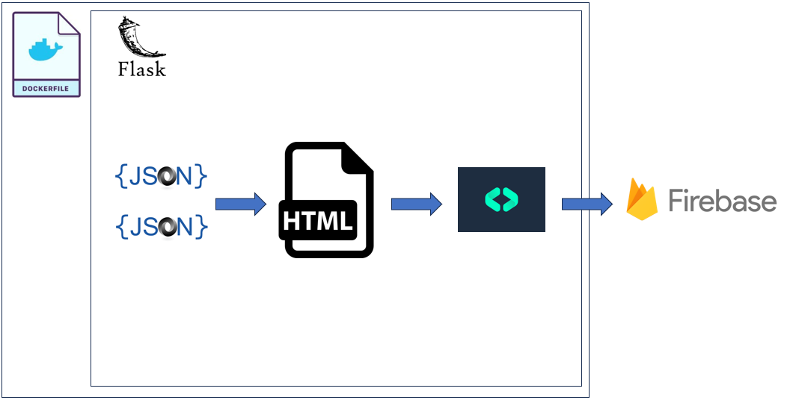

# 🤖 JordanGpt

## 📜 Introduction

I am not a company executive; therefore, I have no secretary, but, with the power of AI, I made the next best thing: `JordanGpt`. `JordanGpt` serves as my personal secretary, answering questions about my experience and career. `JordanGpt` exposes generic routes exposing information about my resume and work experience, in addition to a fine tuned chat bot, trained to be my secretary. This Flask API serves a similar function to a personal website, but with a backend and data flare, displaying knowledge of model deployment, prompt engineering, databases, RESTful APIs, system design, and data collection. Finally, I hope to share a little bit of my youthful creativity, playfully and tastefully combining various domains.

⚠️ **Disclaimer**: The API does monitor interactions, logging the accessed information and chatbot conversations.

## 🛠️ How To Use

1. 🌐 Head over to: [JordanGpt API Docs](https://jordangpt-7wxawbmyea-uc.a.run.app/apidocs/)
2. 🖱️ Engage with any of the displayed methods (primarily `GET`, but also `CREATE`, `REPLACE`, or `UPDATE`).
   
3. ➡️ Click on "Try it out".
4. ✍️ If prompted for a "body", fill it out accordingly. For instance, for `JordanGpt`, type in your question where it says `"question": ""`.
   
5. 🚀 Hit "execute" and there you have it! Results will be neatly presented in a JSON format. A `200` status code means you're good to go.
6. 👍 **Bonus**: Swagger UI provides the `curl` command, letting you take the UI experience to the command line.

## 🖥️ System Requirements and Design

### Requirements:

- 💸 **Budget-Friendly**: Stay under $20/month.
- 🌍 **Portable**: Able to use and deploy anywhere.
- 📁 **Database**: NoSQL db for json.
- ☁️ **Cloud Hosting**: No further explanation needed.
- 🔄 **Adaptable**: Must be scale and swap parts.
- ✅ **Reliable**: All routes should be well-tested.

### Design:

The architecture is split into two main areas: app/API design and LLM model design.

- **Application Design**:

  
  Following this design: my code lives within a dockerfile or container. Containers solve the problem of "my program works on my computer and not yours." Thus, the container makes the code portable, able to be run locally or on the cloud. The container runs inside of it a Flask application which accepts .json files. These .json files hold information about my resume and role descriptions. The app serves a swaggerui interface which allows me test API endpoints and you, the end user, to see the what the API reveals, without code! Moreover, each end point posts data to a Firebase database, telling when, how, and what was accessed. The Firebase database is hosted by Google Cloud, living outside the container. Moreover, this container is hosted in Google Cloud's Container Registry. This registry is then pushed to Google Cloud Run. In essance, I chose Cloud run since it is serveless -- i.e., only costs money when it is running -- and unlike AWS Lambda, Cloud Run can run indefinately. That said, I designed the website to shut down after three minutes of no use.

- **Model Design**:

  My choice was the open-source 'langchain' model. This marvel lets you seamlessly link a variety of LLM tasks.

  

  The journey commences with a vector database housing documents. It then smoothly transitions to user queries. A dedicated `JordanGpt` class smartly fetches relevant data and processes the user's requests, ensuring a meaningful reply every single time.

- **Route Design**:

  Dive deep into all the available routes [right here](https://jordangpt-7wxawbmyea-uc.a.run.app/apidocs/).

- **Overall Design**:
  Overall, this design achieves all six system requirements. i) Between the model, hosting, and database -- the cost stays under 20$/mo. ii) Docker allows the application to be deployed anywhere. iii) Firebase serves as a cheap NoSql database capable of storing all the training data needed. iv) Cloud Run, being serveless, is perfect for hosting low-load (and even large) demand. v) Langchain allows flexibility in terms of the kind of LLM one can run and how exactly it is being tuned and prompted. Moreover, Firebase allows you to run a backend extremely easily, with easy adoption of new features. vi) To test my code, I ran pytest within my dockerfile. The dockerfile will not push unless all the tests pass.

- **Future Elements**:
  In the future, I would like to add a couple of changes. 1) Most critically, I would like to add sign-in, user authentification, and token generation. These tokens would be useful for accessing as an API. 2) I would also like to add rate limitting and max time exceptions. The application should shut down every thirty minutes, although it already shuts down within three minutes on non-use. 3) I would also add rate limitting to my API key. I would not want to be hacked. 4) Although I like that this code exposes the LLM prompting and instructions, which is instructive, I would also like to implement some forms of LLM security. 5) In a perfect world, I add github Actions to automatically push to Google Cloud's Cloud Run.

---

Hope you enjoy exploring and engaging with `JordanGpt`! Dive in and let AI surprise you! 🚀
